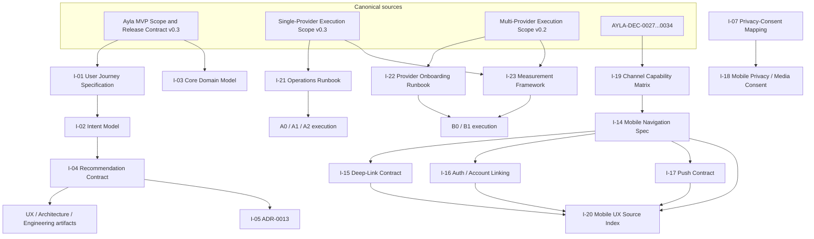

# Ayla MVP v0.3 Downstream Migration Plan

## 1. Purpose and Role

This document is the **migration execution plan** for propagating Ayla MVP Scope and Release Contract v0.3, together with the Single-Provider Technical Pilot Execution Scope v0.3 and the Multi-Provider Product Validation Execution Scope v0.2, into all downstream knowledge artifacts.

The plan:

- is **downstream** of MVP Scope v0.3 and both execution scopes — it never overrides them;
- does **not** redefine release scope or product scope;
- does **not** create new owner decisions (AYLA-DEC-0027…0034 remain closed and are not reopened);
- is **not** a roadmap for the whole product — it covers only the artifacts affected by the v0.3 three-channel reconciliation;
- does **not** start the migration automatically — each wave requires its own execution prompt;
- owns the **ordered migration sequence, dependencies, review gates, and completion criteria** for the downstream propagation.

Product Owner Final Review remains **DEFERRED** until the Final Migration Readiness Review returns `MIGRATION_COMPLETE`.

## 2. Migration Preconditions

All preconditions for materializing this plan are met:

| Precondition | State |
|---|---|
| MVP Scope and Release Contract v0.3 | CROSS_DOCUMENT_ALIGNED |
| Single-Provider Technical Pilot Execution Scope v0.3 | CROSS_DOCUMENT_ALIGNED |
| Multi-Provider Product Validation Execution Scope v0.2 | CROSS_DOCUMENT_ALIGNED |
| Ayla MVP Product Thesis | AYLA-DEC-0027_PROPAGATED |
| Planning verdict | READY_TO_MATERIALIZE_DOWNSTREAM_MIGRATION_PLAN |
| Validation baseline | 0 errors / 20 warnings |
| HEAD at materialization | e397274 — canon: normalize two-phase pilot editorial findings |

## 3. Source Documents and Owner Decisions

Authoritative sources (in hierarchy order):

1. `02 Strategy/Ayla MVP Scope and Release Contract.md` — v0.3, release contract.
2. `02 Strategy/Ayla Single-Provider Technical Pilot Execution Scope.md` — v0.3, phase A0/A1/A2 execution.
3. `02 Strategy/Ayla Multi-Provider Product Validation Execution Scope.md` — v0.2, phase B0/B1 execution.
4. `02 Strategy/Ayla MVP Product Thesis.md` — v0.5, AYLA-DEC-0027 propagated.
5. `00 Foundation/Canon Governance/OWNER_DECISION_REGISTER.md` — AYLA-DEC-0027…0034.

Owner decisions consumed by this plan (closed, not reopened):

| Decision | Content consumed downstream |
|---|---|
| AYLA-DEC-0027 | Mobile App — mandatory primary product channel; MAX Mini App and MAX Bot — mandatory companion channels; full feature parity between channels not required |
| AYLA-DEC-0028 | Two-phase pilot structure: Single-Provider Technical Pilot (A0/A1/A2) precedes Multi-Provider Product Validation (B0/B1) |
| AYLA-DEC-0029 | A2 gate requires a Measurement Framework with the A2 denominator defined |
| AYLA-DEC-0030 | Eligibility-before-ranking; ranking neutrality (no commercial influence on ranking) |
| AYLA-DEC-0031 | Booking via provider adapters; attribution rules fixed per execution scope |
| AYLA-DEC-0032 | Provider boundary: provider workspace without customer PII beyond contract minimum |
| AYLA-DEC-0033 | B1 thresholds and monetization validation require Product Owner approval before B1 |
| AYLA-DEC-0034 | Cold acquisition is out of scope for B0; deferred to B1 with approved channels |

## 4. Migration Inventory

Full inventory: 23 items (I-01…I-23). Classes M1–M5 and severities P0–P3 are defined in §8.

| ID | Artifact | Current path | Exists | Current status | Migration class | Severity | Owner role | Required action | Dependencies | Blocks canonization | Blocks A0/A1/A2 | Blocks B0/B1 | Review gate |
|---|---|---|---|---|---|---|---|---|---|---|---|---|---|
| I-01 | MVP User Journey Specification | `01 Product/User Journeys/Ayla MVP User Journey Specification.md` | yes | v1.0, canonical | M1, M2 | P0 | Product Owner | Apply AYLA-DEC-0027 three-channel framing; replace stale v0.2 section refs; repeat owner approval for LDT alignment | MVP Scope v0.3 | yes | yes | no | Product/Journey Consistency Review |
| I-02 | Intent Model Specification | `03 AI System/Ayla Intent Model Specification.md` | yes | v0.9.2, draft | M2 | P1 | AI System Owner | Update v0.2 refs (§3/§4.1/§4.2/§5); close GAP-1: add intent types for Goal/LDT/check-in/weekly review/triggers | I-01 | no | yes | no | Product/Journey Consistency Review |
| I-03 | Core Domain Model Specification | `05 Architecture/Ayla Core Domain Model Specification.md` | yes | v1.3, canonical | M3, M4 | P2 | Architecture Owner | Update stale refs to v0.2 §4/§5/§11 | MVP Scope v0.3 | no | no | yes | Architecture Review |
| I-04 | MVP Recommendation Contract | `05 Architecture/Ayla MVP Recommendation Contract.md` | yes | v0.3, draft | M2 | P1 | Architecture Owner | Remove memory-first framing from rationale; fix wrong pin "UJS v0.3" → UJS v1.0; extend §16 beyond MAX-only | I-01, I-02 | no | yes | no | Architecture Review |
| I-05 | ADR-0013 Recommendation Snapshot | `05 Architecture/ADR-0013 Recommendation Snapshot.md` | yes | accepted | M4 | P2 | Architecture Owner | Update refs to v0.2 §4.1 items 9/11; fix broken path `contracts/draft-mvp-recommendation-contract.md` → `contracts/recommendation-ux-addendum.md` | I-04 | no | no | no | Architecture Review |
| I-06 | UX MVP source index | `01 Product/UX MVP/00-ux-source-index.md` | yes | active working index | M4 | P3 | UX Owner | Replace non-canonical paths `Ayla/ayla-knowledge/`; update v0.2 anchors §3–5/§7/§10 | MVP Scope v0.3 | no | no | no | Mobile Channel Readiness Review |
| I-07 | Draft privacy-consent mapping | `01 Product/UX MVP/contracts/draft-privacy-consent-mapping.md` | yes | draft, Q1–Q10 pending with Privacy Owner since 2026-07-29 | M2 | P1 | Privacy Owner | Obtain Q1–Q10 answers; update SRC-01 refs (v0.2 §8/§10); extend to LDT/media/mobile surfaces | Privacy Owner answers | no | yes | no | Privacy/Safety Review |
| I-08 | Recommendation UX addendum | `01 Product/UX MVP/contracts/recommendation-ux-addendum.md` | yes | draft | M2, M4 | P2 | UX Owner | Update refs (v0.2 §4.1 items 2/9/11); extend surfaces beyond bot DM/Mini App to Mobile App | I-04 | no | yes | no | Mobile Channel Readiness Review |
| I-09 | SCR-CUST-004 (screen inventory) | `01 Product/UX MVP/02-screen-inventory-customer.md` | yes | draft, OQ-REC-2/4/6/7 pending | M2, M4 | P2 | UX Owner | Update old anchor (v0.2 §4.1 item 9); add Mobile App surface for bot-DM-only entries; resolve OQ-REC-2/4/6/7 | I-08 | no | yes | no | Mobile Channel Readiness Review |
| I-10 | intent-registry.yaml | `03 AI System/Contracts/intent-registry.yaml` | yes | active | M4 | P3 | AI System Owner | Fix comment referencing v0.2 §4 | I-02 | no | no | no | Product/Journey Consistency Review |
| I-11 | Ayla.md MOC | `Ayla.md` | yes | active | M1, M4 | P3 | Canon Architect | Update statuses: MVP Scope 0.2→0.3, Intent Model 0.1→0.9.2, Thesis 0.4→0.5, Vision 1.4→2.0; register execution scopes and this plan | MVP Scope v0.3 | yes | no | no | none (editorial) |
| I-12 | CANON_INDEX | `00 Foundation/Canon Governance/CANON_INDEX.md` | yes | active | M1 | P3 | Canon Architect | Fix line 58 entry MVP Scope v0.2 → v0.3; add execution scopes and this plan | MVP Scope v0.3 | yes | no | no | none (editorial) |
| I-13 | CANON_WORKSTREAM_STATUS | `00 Foundation/Canon Governance/CANON_WORKSTREAM_STATUS.md` | yes | stale | M1 | P3 | Canon Architect | Replace stale "Next action: Initialize MVP Scope Canon Window" with migration-wave state | MVP Scope v0.3 | yes | no | no | none (editorial) |
| I-14 | Mobile navigation specification | `01 Product/UX MVP/Ayla Mobile Navigation Specification.md` (recommended) | no | TO_BE_CREATED | M5 | P1 | UX Owner | Create per contract §6 | AYLA-DEC-0027, I-19 | no | yes | no | Mobile Channel Readiness Review |
| I-15 | Mobile deep-link contract | `01 Product/UX MVP/contracts/mobile-deep-link-contract.md` (recommended) | no | TO_BE_CREATED | M5 | P2 | UX Owner | Create per contract §6 | I-14 | no | yes | no | Mobile Channel Readiness Review |
| I-16 | Mobile auth/account-linking flow | `01 Product/UX MVP/flows/mobile-auth-account-linking.md` (recommended) | no | TO_BE_CREATED | M5 | P1 | UX Owner | Create per contract §6 | I-14, I-07 | no | yes | no | Mobile Channel Readiness Review |
| I-17 | Push notification contract | `01 Product/UX MVP/contracts/push-notification-contract.md` (recommended) | no | TO_BE_CREATED | M5 | P2 | UX Owner | Create per contract §6 | I-14, I-07 | no | yes | no | Mobile Channel Readiness Review |
| I-18 | Mobile privacy/media consent mapping | `01 Product/UX MVP/contracts/mobile-privacy-media-consent-mapping.md` (recommended) | no | TO_BE_CREATED | M5 | P1 | Privacy Owner | Create per contract §6 | I-07, AYLA-DEC-0027 | no | yes | no | Privacy/Safety Review |
| I-19 | Channel capability matrix | `01 Product/UX MVP/Ayla Channel Capability Matrix.md` (recommended) | no | TO_BE_CREATED | M5 | P1 | Product Owner | Create per contract §6 | AYLA-DEC-0027, MVP Scope v0.3 | no | yes | yes | Mobile Channel Readiness Review |
| I-20 | Mobile UX source index | `01 Product/UX MVP/00-ux-source-index-mobile.md` (recommended) | no | TO_BE_CREATED | M5 | P3 | UX Owner | Create per contract §6 | I-14…I-17 | no | no | no | Mobile Channel Readiness Review |
| I-21 | Operations Runbook | `02 Strategy/Ayla Single-Provider Pilot Operations Runbook.md` (recommended) | no | TO_BE_CREATED (GAP-3) | M5 | P1 | Operations Owner | Create per contract §6 | SP Execution Scope v0.3 | no | yes | no | Operations Readiness Review |
| I-22 | Provider Onboarding Runbook | `02 Strategy/Ayla Provider Onboarding Runbook.md` (recommended) | no | TO_BE_CREATED (GAP-4) | M5 | P1 | Operations Owner | Create per contract §6 | MP Execution Scope v0.2 | no | no | yes | Operations Readiness Review |
| I-23 | Measurement Framework | `02 Strategy/Ayla MVP Measurement Framework.md` (recommended) | no | TO_BE_CREATED (GAP-2) | M5 | P1 | Product Owner | Create per contract §6, incl. A2 denominator per AYLA-DEC-0029 | MVP Scope v0.3, both execution scopes | no | yes (A2) | yes (B1) | Analytics/Measurement Review |

## 5. Existing Artifact Audit

Exact stale references and required replacements carried over from the planning report.

### I-01 — MVP User Journey Specification (P0-01, canonical conflict)

- **MAX-only channel conflict**: lines ~106–107 and ~926–930 frame the MAX Bot / MAX Mini App as the product channel, contradicting AYLA-DEC-0027 (Mobile App = primary; MAX Mini App / MAX Bot = companions). Deterministic resolution: apply the three-channel model from MVP Scope v0.3; full feature parity is not required.
- **Stale v0.2 section refs**: ~20 references to MVP Scope v0.2 §2/§3/§4.1/§4.2/§5/§6/§7/§9 → repoint to v0.3 equivalents.
- **LDT alignment**: changes touch Living Digital Twin alignment (Foundation principle №5) → repeat owner approval required after revision.

### I-02 — Intent Model Specification

- Refs to v0.2 §3/§4.1/§4.2/§5 → v0.3 equivalents.
- **GAP-1 (coverage)**: no intent types for Goal setting, LDT check-in, weekly review, and trigger-based re-engagement introduced by v0.3 → extend registry and spec.

### I-03 — Core Domain Model Specification

- Refs to v0.2 §4/§5/§11 → v0.3 equivalents. No entity-model conflict identified.

### I-04 — MVP Recommendation Contract

- Rationale still cites the pre-v0.3 **memory-first thesis** → align with v0.3 recommendation contract basis.
- Wrong version pin: "UJS v0.3" → **UJS v1.0** (`Ayla MVP User Journey Specification`).
- §16 surfaces are MAX-only → extend to Mobile App per AYLA-DEC-0027.

### I-05 — ADR-0013 Recommendation Snapshot

- Refs to v0.2 §4.1 items 9/11 → v0.3 equivalents.
- Broken path: `contracts/draft-mvp-recommendation-contract.md` → renamed to `contracts/recommendation-ux-addendum.md`.

### I-06 — UX MVP source index

- Non-canonical source paths under `Ayla/ayla-knowledge/` → canonical `ayla-knowledge-canon-final` paths.
- Anchors to v0.2 §3–5/§7/§10 → v0.3 anchors.

### I-07 — Draft privacy-consent mapping

- Q1–Q10 to Privacy Owner unanswered since 2026-07-29 → answers required before A0.
- SRC-01 refs to v0.2 §8/§10 → v0.3 equivalents.
- No coverage of LDT, media capture, or mobile surfaces → extend (feeds I-18).

### I-08 — Recommendation UX addendum

- Refs to v0.2 §4.1 items 2/9/11 → v0.3 equivalents.
- Surfaces limited to bot DM / Mini App → add Mobile App surface.

### I-09 — SCR-CUST-004 (screen inventory)

- Old anchor v0.2 §4.1 item 9 → v0.3 equivalent.
- Surface listed as bot DM only → add Mobile App surface.
- OQ-REC-2/4/6/7 pending → route to owner decisions before A0.

### I-10 — intent-registry.yaml

- Header comment references v0.2 §4 → v0.3 equivalent.

### I-11 / I-12 / I-13 — Registries and MOC

- `Ayla.md`: stale statuses (MVP Scope 0.2, Intent Model 0.1, Thesis 0.4, Vision 1.4) → 0.3 / 0.9.2 / 0.5 / 2.0; add both execution scopes and this plan.
- `CANON_INDEX.md` line 58: MVP Scope listed as v0.2 → v0.3; add execution scopes and this plan.
- `CANON_WORKSTREAM_STATUS.md`: stale "Next action: Initialize MVP Scope Canon Window" → reflect D0–D6 migration state.

## 6. TO_BE_CREATED Artifact Contracts

Contracts for I-14…I-23. The artifacts themselves are **not** created by this plan.

### I-14 — Mobile Navigation Specification

- **Recommended path**: `01 Product/UX MVP/Ayla Mobile Navigation Specification.md`
- **Title**: Ayla Mobile Navigation Specification
- **Type**: specification · **Status**: draft · **Owner role**: UX Owner
- **depends_on**: `[[Ayla MVP Scope and Release Contract]]`, ``Ayla Channel Capability Matrix` (TO_BE_CREATED)`
- **related**: `[[Ayla MVP User Journey Specification]]`
- **Minimum sections**: purpose; channel model per AYLA-DEC-0027; primary navigation structure; companion-channel entry points; deep-link targets (ref I-15); empty/error states; acceptance criteria.
- **Acceptance criteria**: every Mobile App surface referenced by UJS v1.0 (post-revision) has a navigation entry; no MAX-only framing.
- **Review gate**: Mobile Channel Readiness Review.

### I-15 — Mobile Deep-Link Contract

- **Recommended path**: `01 Product/UX MVP/contracts/mobile-deep-link-contract.md`
- **Title**: Ayla Mobile Deep-Link Contract
- **Type**: contract · **Status**: draft · **Owner role**: UX Owner
- **depends_on**: ``Ayla Mobile Navigation Specification` (TO_BE_CREATED)`
- **related**: `[[Ayla MVP Recommendation Contract]]`
- **Minimum sections**: deep-link scheme; target inventory; parameter contract; fallback behavior; companion-channel handoff links.
- **Acceptance criteria**: every push payload (I-17) and every recommendation card CTA resolves to a defined deep link.
- **Review gate**: Mobile Channel Readiness Review.

### I-16 — Mobile Auth / Account-Linking Flow

- **Recommended path**: `01 Product/UX MVP/flows/mobile-auth-account-linking.md`
- **Title**: Ayla Mobile Auth and Account-Linking Flow
- **Type**: specification · **Status**: draft · **Owner role**: UX Owner
- **depends_on**: ``Ayla Mobile Navigation Specification` (TO_BE_CREATED)`, `[[draft-privacy-consent-mapping]]`
- **related**: `[[Ayla MVP User Journey Specification]]`
- **Minimum sections**: identity model; Mobile App auth; MAX account linking; consent checkpoints; failure and recovery paths.
- **Acceptance criteria**: a single user identity is resolvable across all three channels; consent checkpoints match I-07/I-18.
- **Review gate**: Mobile Channel Readiness Review.

### I-17 — Push Notification Contract

- **Recommended path**: `01 Product/UX MVP/contracts/push-notification-contract.md`
- **Title**: Ayla Push Notification Contract
- **Type**: contract · **Status**: draft · **Owner role**: UX Owner
- **depends_on**: ``Ayla Mobile Navigation Specification` (TO_BE_CREATED)`, `[[draft-privacy-consent-mapping]]`
- **related**: `[[Ayla Intent Model Specification]]`
- **Minimum sections**: trigger inventory (incl. weekly review, re-engagement); payload contract; deep-link binding (I-15); opt-in/opt-out; rate limits.
- **Acceptance criteria**: every trigger maps to an intent type from the revised Intent Model; opt-out honored per consent mapping.
- **Review gate**: Mobile Channel Readiness Review.

### I-18 — Mobile Privacy / Media Consent Mapping

- **Recommended path**: `01 Product/UX MVP/contracts/mobile-privacy-media-consent-mapping.md`
- **Title**: Ayla Mobile Privacy and Media Consent Mapping
- **Type**: contract · **Status**: draft · **Owner role**: Privacy Owner
- **depends_on**: `[[draft-privacy-consent-mapping]]`
- **related**: `[[Consent Scope Registry]]`, `[[Data Inventory Matrix]]`
- **Minimum sections**: mobile permission inventory (camera/media/notifications); LDT data capture consent; per-channel consent scopes; revocation behavior.
- **Acceptance criteria**: covers every mobile permission used by I-14…I-17; consistent with Consent Scope Registry; Q1–Q10 answers incorporated.
- **Review gate**: Privacy/Safety Review.

### I-19 — Channel Capability Matrix

- **Recommended path**: `01 Product/UX MVP/Ayla Channel Capability Matrix.md`
- **Title**: Ayla Channel Capability Matrix
- **Type**: specification · **Status**: draft · **Owner role**: Product Owner
- **depends_on**: `[[Ayla MVP Scope and Release Contract]]`
- **related**: `[[Ayla Single-Provider Technical Pilot Execution Scope]]`, `[[Ayla Multi-Provider Product Validation Execution Scope]]`
- **Minimum sections**: capability list; per-channel support matrix (Mobile App / MAX Mini App / MAX Bot); A0/A1/A2/B0/B1 capability gating; explicit non-parity statement per AYLA-DEC-0027.
- **Acceptance criteria**: every capability in both execution scopes appears exactly once per channel row; no capability contradicts an execution scope.
- **Review gate**: Mobile Channel Readiness Review.

### I-20 — Mobile UX Source Index

- **Recommended path**: `01 Product/UX MVP/00-ux-source-index-mobile.md`
- **Title**: Ayla Mobile UX Source Index
- **Type**: index · **Status**: draft · **Owner role**: UX Owner
- **depends_on**: ``Ayla Mobile Navigation Specification` (TO_BE_CREATED)`, ``Ayla Mobile Deep-Link Contract` (TO_BE_CREATED)`, ``Ayla Mobile Auth and Account-Linking Flow` (TO_BE_CREATED)`, ``Ayla Push Notification Contract` (TO_BE_CREATED)`
- **related**: `[[00-ux-source-index]]`
- **Minimum sections**: canonical source list for all mobile artifacts; anchor map; provenance.
- **Acceptance criteria**: every mobile artifact (I-14…I-18) is indexed with canonical paths only.
- **Review gate**: Mobile Channel Readiness Review.

### I-21 — Operations Runbook (GAP-3)

- **Recommended path**: `02 Strategy/Ayla Single-Provider Pilot Operations Runbook.md`
- **Title**: Ayla Single-Provider Pilot Operations Runbook
- **Type**: runbook · **Status**: draft · **Owner role**: Operations Owner
- **depends_on**: `[[Ayla Single-Provider Technical Pilot Execution Scope]]`
- **related**: `[[Ayla MVP Scope and Release Contract]]`
- **Minimum sections**: manual operations inventory per SP scope; escalation paths; booking support procedure; incident handling; daily/weekly checklists for A0/A1/A2.
- **Acceptance criteria**: every manual-operations item in the SP execution scope has a runbook entry.
- **Review gate**: Operations Readiness Review.

### I-22 — Provider Onboarding Runbook (GAP-4)

- **Recommended path**: `02 Strategy/Ayla Provider Onboarding Runbook.md`
- **Title**: Ayla Provider Onboarding Runbook
- **Type**: runbook · **Status**: draft · **Owner role**: Operations Owner
- **depends_on**: `[[Ayla Multi-Provider Product Validation Execution Scope]]`
- **related**: ``Ayla Single-Provider Pilot Operations Runbook` (TO_BE_CREATED)`
- **Minimum sections**: provider eligibility checklist; onboarding steps; provider workspace setup; booking adapter verification; offboarding.
- **Acceptance criteria**: eligibility-before-ranking per AYLA-DEC-0030 is enforceable from the checklist alone.
- **Review gate**: Operations Readiness Review.

### I-23 — Measurement Framework (GAP-2)

- **Recommended path**: `02 Strategy/Ayla MVP Measurement Framework.md`
- **Title**: Ayla MVP Measurement Framework
- **Type**: specification · **Status**: draft · **Owner role**: Product Owner
- **depends_on**: `[[Ayla MVP Scope and Release Contract]]`, `[[Ayla Single-Provider Technical Pilot Execution Scope]]`, `[[Ayla Multi-Provider Product Validation Execution Scope]]`
- **related**: `[[Ayla Domain Event Registry]]`
- **Minimum sections**: metric inventory for A0/A1/A2/B0/B1; **A2 denominator per AYLA-DEC-0029**; event taxonomy binding; attribution metrics per AYLA-DEC-0031; monetization metrics per AYLA-DEC-0033.
- **Acceptance criteria**: every gate metric in both execution scopes has a defined denominator, source event, and owner.
- **Review gate**: Analytics/Measurement Review.

## 7. Dependency Graph



Text form (required chains):

```text
Canonical sources → MVP Scope → User Journey → Intent Model → Recommendation Contract → UX / Architecture / Engineering
AYLA-DEC-0027 → Channel Capability Matrix → Mobile Navigation / Auth / Deep Link / Push / Privacy → Mobile UX Source Index
Single-Provider Scope → Operations Runbook → A0/A1/A2
Multi-Provider Scope → Provider Onboarding / Ranking / Attribution / Measurement → B0/B1
```

**No circular dependencies identified.**

## 8. Migration Classes and Severity Model

Migration classes (when the work must land):

| Class | Meaning |
|---|---|
| M1 | Mandatory before MVP Scope canonization |
| M2 | Mandatory before A0/A1/A2 execution |
| M3 | Mandatory before B0/B1 execution |
| M4 | Propagation / editorial alignment |
| M5 | TO_BE_CREATED artifact |

Severity model (how damaging the gap is):

| Severity | Meaning |
|---|---|
| P0 | Canonical conflict — contradicts an owner decision or the release contract |
| P1 | Execution blocker — a phase cannot start or a gate cannot be evaluated without it |
| P2 | Coherence requirement — cross-document consistency is broken without it |
| P3 | Editorial / navigation — stale pointers, statuses, comments |

Rules:

- **Class ≠ severity.** A class says *when*; severity says *how bad*. Example: I-12 CANON_INDEX is M1 (before canonization) but only P3 (editorial).
- One item may carry several migration classes (e.g., I-01 is M1 + M2).
- **P0-01** (I-01 UJ channel conflict) has a deterministic resolution via AYLA-DEC-0027: apply the three-channel model with no parity requirement. No new owner decision is needed for the resolution itself; repeat owner approval is required only because the revision touches LDT alignment.

## 9. Migration Waves

### D0 — Registry and Reference Normalization

- **Goal**: registries, MOC, and workstream status point at v0.3 reality.
- **Artifacts**: I-10, I-11, I-12, I-13.
- **Entry gate**: this plan materialized (v0.1).
- **Exit gate**: Ayla.md, CANON_INDEX, CANON_WORKSTREAM_STATUS, intent-registry comment reflect v0.3 + execution scopes + this plan.
- **Blockers**: none.
- **Owner roles**: Canon Architect.
- **Parallelization**: all four items in parallel.
- **Commit strategy**: one atomic commit for D0.
- **Validation**: `python scripts/validate_knowledge.py` → 0 errors, warnings ≤ 20.
- **Required review**: none (editorial); verified by diff inspection.

### D1 — Product/Journey Alignment

- **Goal**: close P0-01; align journey and intent layer with v0.3.
- **Artifacts**: I-01, I-02.
- **Entry gate**: D0 complete.
- **Exit gate**: Product/Journey Consistency Review = APPROVED; repeat owner approval of UJ revision recorded.
- **Blockers**: repeat owner approval for I-01 (LDT alignment, Foundation principle №5).
- **Owner roles**: Product Owner, AI System Owner.
- **Parallelization**: I-01 and I-02 sequential (Intent Model depends on UJ revision).
- **Commit strategy**: one commit per artifact.
- **Validation**: 0 errors, warnings ≤ 20; grep sweep for stale v0.2 refs.
- **Required review**: Product/Journey Consistency Review.

### D2 — Consent/Privacy/Channel Contracts

- **Goal**: consent layer covers three channels, LDT, and media capture.
- **Artifacts**: I-07, I-18, I-19.
- **Entry gate**: D1 complete; Privacy Owner answers Q1–Q10 received.
- **Exit gate**: Privacy/Safety Review = APPROVED.
- **Blockers**: Privacy Owner Q1–Q10 (open since 2026-07-29).
- **Owner roles**: Privacy Owner, Product Owner.
- **Parallelization**: I-19 parallel to I-07/I-18; I-18 sequential after I-07.
- **Commit strategy**: one commit per artifact.
- **Validation**: 0 errors; Consent Scope Registry cross-check.
- **Required review**: Privacy/Safety Review.

### D3 — Domain/Architecture Contracts

- **Goal**: architecture layer cites v0.3 and three-channel surfaces.
- **Artifacts**: I-03, I-04, I-05 (plus Domain Event Registry spot-check).
- **Entry gate**: D1 complete.
- **Exit gate**: Architecture Review = APPROVED.
- **Blockers**: none after D1.
- **Owner roles**: Architecture Owner.
- **Parallelization**: I-03/I-04/I-05 in parallel.
- **Commit strategy**: one commit per artifact.
- **Validation**: 0 errors; broken-path sweep (`draft-mvp-recommendation-contract`).
- **Required review**: Architecture Review.

### D4 — UX/Mobile Artifacts

- **Goal**: mobile channel artifacts exist and UX contracts cover all three channels.
- **Artifacts**: I-14, I-15, I-16, I-17, I-20 (create); I-06, I-08, I-09 (revise).
- **Entry gate**: D2 complete (I-19 needed by I-14); OQ-REC-2/4/6/7 resolved.
- **Exit gate**: Mobile Channel Readiness Review = APPROVED.
- **Blockers**: I-19 (channel capability matrix) from D2; OQ-REC answers.
- **Owner roles**: UX Owner.
- **Parallelization**: I-14 first; I-15/I-16/I-17 in parallel after I-14; I-20 last; I-06/I-08/I-09 in parallel with creation work.
- **Commit strategy**: one commit per artifact.
- **Validation**: 0 errors; index cross-check.
- **Required review**: Mobile Channel Readiness Review.

### D5 — Analytics/Measurement/Operations

- **Goal**: measurement and operations layer ready for gates A2 and B0/B1.
- **Artifacts**: I-23 (Measurement Framework, incl. event taxonomy binding), I-21, I-22.
- **Entry gate**: D3 complete.
- **Exit gate**: Analytics/Measurement Review = APPROVED and Operations Readiness Review = APPROVED.
- **Blockers**: A2 denominator definition (AYLA-DEC-0029) — Product Owner input.
- **Owner roles**: Product Owner, Operations Owner.
- **Parallelization**: I-21/I-22 in parallel; I-23 independent.
- **Commit strategy**: one commit per artifact.
- **Validation**: 0 errors; metric-to-event traceability check.
- **Required review**: Analytics/Measurement Review; Operations Readiness Review.

### D6 — Final Migration Readiness Reviews

- **Goal**: verify the whole migration landed; open the path to canonization.
- **Artifacts**: migration matrix update (this plan, §4 statuses); all migrated artifacts.
- **Entry gate**: D0–D5 complete, all gates passed.
- **Exit gate**: Final Migration Readiness Review = `MIGRATION_COMPLETE`.
- **Blockers**: any unresolved P0/P1.
- **Owner roles**: Canon Architect, Product Owner.
- **Parallelization**: n/a (single review).
- **Commit strategy**: one commit (matrix update + review record).
- **Validation**: 0 errors; worktree clean.
- **Required review**: Final Migration Readiness Review → then Product Owner Final Review opens.

## 10. Ordered Execution Steps

Eighteen steps. Step 1 is completed by the commit that introduces this plan. Each subsequent step runs under its own execution prompt; recommended prompt file names are listed in the table (prompts themselves are not part of this document).

| Step | Wave | Artifact(s) | Exact action | Prerequisites | Allowed files | Expected commit message | Validation | Required review | Next allowed action |
|---|---|---|---|---|---|---|---|---|---|
| 1 | — | This plan | Materialize Migration Plan v0.1 | Planning verdict READY | `02 Strategy/Ayla MVP v0.3 Downstream Migration Plan.md` | `canon: add MVP v0.3 downstream migration plan` | 0 errors, warnings ≤ 20 | none | Step 2 |
| 2 | — | This plan | Read-only internal consistency review of the plan | Step 1 | none (read-only) | none (review only) | review report | Migration Plan Internal Consistency Review | Step 3 |
| 3 | D0 | I-11 | Update Ayla.md MOC statuses (MVP Scope 0.3, Intent 0.9.2, Thesis 0.5, Vision 2.0); register execution scopes + this plan | Step 2 | `Ayla.md` | `canon: normalize MOC statuses for MVP v0.3` | 0 errors | none (editorial) | Step 4 |
| 4 | D0 | I-12, I-13 | Fix CANON_INDEX line 58 (v0.2→v0.3) + add entries; replace stale next-action in CANON_WORKSTREAM_STATUS | Step 3 | `CANON_INDEX.md`, `CANON_WORKSTREAM_STATUS.md` | `canon: normalize registries for MVP v0.3` | 0 errors | none (editorial) | Step 5 |
| 5 | D0 | I-10 | Fix intent-registry.yaml comment anchor (v0.2 §4 → v0.3) | Step 4 | `03 AI System/Contracts/intent-registry.yaml` | `canon: fix intent registry source anchor` | 0 errors | none (editorial) | Step 6 |
| 6 | D1 | I-01 | Revise UJ Specification: three-channel model per AYLA-DEC-0027; repoint ~20 stale v0.2 refs; obtain repeat owner approval (LDT alignment) | Step 5, owner approval booked | `01 Product/User Journeys/Ayla MVP User Journey Specification.md` | `canon: align MVP user journeys with three-channel model` | 0 errors; stale-ref grep clean | Product Owner approval | Step 7 |
| 7 | D1 | I-02 | Revise Intent Model: update v0.2 refs; add Goal/LDT/check-in/weekly-review/trigger intent types (GAP-1) | Step 6 | `03 AI System/Ayla Intent Model Specification.md` | `canon: extend intent model for MVP v0.3 journeys` | 0 errors | none | Step 8 |
| 8 | D1 | I-01, I-02 | Product/Journey Consistency Review | Step 7 | none (read-only) | review record only | review report | Product/Journey Consistency Review | Step 9 |
| 9 | D2 | I-07 | Obtain Privacy Owner answers Q1–Q10; update draft privacy-consent mapping (SRC-01 refs, LDT/media/mobile) | Step 8, Privacy Owner answers | `01 Product/UX MVP/contracts/draft-privacy-consent-mapping.md` | `canon: resolve privacy-consent mapping for MVP v0.3` | 0 errors | none | Step 10 |
| 10 | D2 | I-18, I-19 | Create Channel Capability Matrix; create mobile privacy/media consent mapping | Step 9 | I-18, I-19 recommended paths | `canon: add channel capability matrix and mobile consent mapping` | 0 errors | Privacy/Safety Review (Step 11) | Step 11 |
| 11 | D2 | I-07, I-18, I-19 | Privacy/Safety Review | Step 10 | none (read-only) | review record only | review report | Privacy/Safety Review | Step 12 |
| 12 | D3 | I-03, I-04, I-05 | Update CDM refs; fix Recommendation Contract (memory-first framing, UJS pin v1.0, §16 channels); fix ADR-0013 refs + broken path; Architecture Review | Step 8 (D1 gate) | three Architecture files | `canon: align architecture contracts with MVP v0.3` | 0 errors; broken-path sweep clean | Architecture Review | Step 13 |
| 13 | D4 | I-14, I-15, I-16, I-17 | Create mobile navigation spec, deep-link contract, auth/account-linking flow, push contract (I-14 first, then parallel) | Step 11 (I-19), Step 9 (consent) | four recommended paths | `canon: add mobile channel contracts for MVP v0.3` | 0 errors | none | Step 14 |
| 14 | D4 | I-06, I-08, I-09, I-20 | Update UX source index (canonical paths, v0.3 anchors); extend recommendation UX addendum + SCR-CUST-004 to Mobile App; create mobile UX source index | Step 13, OQ-REC-2/4/6/7 resolved | four UX files | `canon: align UX surfaces with three-channel model` | 0 errors | Mobile Channel Readiness Review (Step 15) | Step 15 |
| 15 | D4 | all D4 artifacts | Mobile Channel Readiness Review | Step 14 | none (read-only) | review record only | review report | Mobile Channel Readiness Review | Step 16 |
| 16 | D5 | I-21, I-22, I-23 | Create Operations Runbook, Provider Onboarding Runbook, Measurement Framework (A2 denominator per AYLA-DEC-0029; event taxonomy binding) | Step 12 (D3 gate), PO input on A2 denominator | three recommended paths | `canon: add measurement framework and pilot runbooks` | 0 errors; metric-to-event traceability | Analytics/Measurement Review; Operations Readiness Review | Step 17 |
| 17 | D6 | migration matrix (this plan, §4) | Final Migration Readiness Review; update matrix statuses; verdict target `MIGRATION_COMPLETE` | Steps 1–16, all gates passed | this plan (matrix only) | `canon: record MVP v0.3 migration completion` | 0 errors; worktree clean | Final Migration Readiness Review | Step 18 |
| 18 | D6 | — | Open Product Owner Final Review (canonization path) | Step 17 verdict `MIGRATION_COMPLETE` | per PO review prompt | per PO review prompt | per PO review prompt | Product Owner Final Review | window closure decision |

Recommended execution prompt names (to be authored separately, in `D:\Проекты\Ayla` per window convention):

```text
MVP_V03_MIGRATION_PLAN_V0_1_INTERNAL_CONSISTENCY_REVIEW_PROMPT.md
MVP_V03_MIGRATION_D0_REGISTRY_NORMALIZATION_PROMPT.md
MVP_V03_MIGRATION_D1_USER_JOURNEY_REVISION_PROMPT.md
MVP_V03_MIGRATION_D1_INTENT_MODEL_REVISION_PROMPT.md
MVP_V03_MIGRATION_D1_PRODUCT_JOURNEY_REVIEW_PROMPT.md
MVP_V03_MIGRATION_D2_PRIVACY_CONSENT_PROMPT.md
MVP_V03_MIGRATION_D2_CHANNEL_MATRIX_AND_MOBILE_CONSENT_PROMPT.md
MVP_V03_MIGRATION_D2_PRIVACY_SAFETY_REVIEW_PROMPT.md
MVP_V03_MIGRATION_D3_ARCHITECTURE_ALIGNMENT_PROMPT.md
MVP_V03_MIGRATION_D4_MOBILE_CONTRACTS_PROMPT.md
MVP_V03_MIGRATION_D4_UX_SURFACE_ALIGNMENT_PROMPT.md
MVP_V03_MIGRATION_D4_MOBILE_READINESS_REVIEW_PROMPT.md
MVP_V03_MIGRATION_D5_MEASUREMENT_AND_RUNBOOKS_PROMPT.md
MVP_V03_MIGRATION_D6_FINAL_READINESS_REVIEW_PROMPT.md
```

## 11. Parallelization Rules

- Waves are strictly sequential: D0 → D1 → D2 → D3 → D4 → D5 → D6. A wave starts only when the previous wave's exit gate is met.
- D3 may start after D1 (it does not depend on D2), but its review evidence joins the D6 record; the default order remains sequential unless the window owner explicitly parallelizes.
- Within D0: all items parallel. Within D1: I-01 before I-02. Within D2: I-19 parallel with I-07 → I-18. Within D4: I-14 first, I-15/I-16/I-17 parallel, I-20 last; revisions I-06/I-08/I-09 parallel with creations. Within D5: I-21/I-22/I-23 parallel.
- One atomic commit per artifact (D0 may use one commit for all four registry items); never mix waves in one commit.
- No parallel edits to the same file; no subagents (window constraint).

## 12. Owner Decisions and Governance Checkpoints

Classification carried over from the planning report without extension. AYLA-DEC-0027…0034 are **not** reopened.

- **Owner Decisions Required Now**: none.
- **Owner Decisions Before A0**: Privacy Owner answers Q1–Q10 (I-07); resolution of OQ-REC-2/4/6/7 (I-09); repeat owner approval of the revised UJ Specification (I-01, LDT alignment).
- **Owner Decisions Before A2**: Product Owner confirms the Measurement Framework including the A2 denominator (AYLA-DEC-0029).
- **Owner Decisions Before B0**: none.
- **Owner Decisions Before B1**: Product Owner approval of B1 thresholds and monetization validation (AYLA-DEC-0033); approval of the cold-acquisition channel list (AYLA-DEC-0034).

## 13. Review Gates

Seven gates. Product Owner Final Review opens only after `MIGRATION_COMPLETE`.

| Gate | Inputs | Criteria | Blocking findings | Allowed verdicts | Downstream route |
|---|---|---|---|---|---|
| Product/Journey Consistency Review | I-01, I-02 post-revision | P0-01 closed per AYLA-DEC-0027; no stale v0.2 refs; GAP-1 intent coverage; UJ↔Intent traceability | any remaining MAX-only framing; missing LDT/check-in intents | APPROVED / NEEDS_WORK | D2, D3 |
| Privacy/Safety Review | I-07, I-18, I-19 | Q1–Q10 answered; three-channel consent coverage; Consent Scope Registry consistency | unanswered consent question; media/LDT gap | APPROVED / NEEDS_WORK | D4 |
| Architecture Review | I-03, I-04, I-05 | v0.3 refs only; UJS pin v1.0; memory-first framing removed; no broken paths | canonical contradiction; broken reference | APPROVED / NEEDS_WORK | D5 |
| Mobile Channel Readiness Review | I-06, I-08, I-09, I-14…I-17, I-20 | all three channels covered; deep-link/push/auth contracts complete; capability matrix honored | missing Mobile App surface; contract gap | APPROVED / NEEDS_WORK | D6 input |
| Analytics/Measurement Review | I-23 | every gate metric has denominator, source event, owner; A2 denominator per AYLA-DEC-0029 | undefined gate metric | APPROVED / NEEDS_WORK | D6 input |
| Operations Readiness Review | I-21, I-22 | every manual-ops and onboarding item actionable; AYLA-DEC-0030 enforceable from checklist | missing runbook entry | APPROVED / NEEDS_WORK | D6 input |
| Final Migration Readiness Review | full migration matrix + all gate records | §16 completion criteria 1–7 met | any open P0/P1; any failed gate | MIGRATION_COMPLETE / MIGRATION_INCOMPLETE | Product Owner Final Review |

## 14. Stop Conditions

Stop the migration and escalate to the window owner if any of the following occurs:

1. An unresolved P0 finding survives its target wave.
2. An authoritative source document is missing or renamed.
3. Two owner decisions contradict each other.
4. A circular dependency appears in the graph (§7).
5. The source-of-truth for an artifact becomes unknown or disputed.
6. A consent question has no identifiable owner.
7. Channel ownership (Mobile App vs MAX Mini App vs MAX Bot) is unclear for a capability.
8. A recommended path collides with an existing file of different content.

**As of v0.1 (2026-07-31): no stop condition is active.**

## 15. Validation and Evidence

After every migration commit:

```text
python scripts/validate_knowledge.py   # expected: 0 errors, warnings ≤ 20 (baseline)
git diff --check
git status --short                     # only wave-allowed files changed
```

Additional evidence per wave: stale-reference grep sweeps (D1, D3), Consent Scope Registry cross-check (D2), index cross-check (D4), metric-to-event traceability check (D5), and the review records for all seven gates (D6). Push is not performed at any step.

## 16. Completion Criteria

This migration plan is considered executed when:

1. all M1 items are closed;
2. all P0 and P1 findings are closed;
3. D1–D5 reviews are passed (APPROVED);
4. D6 verdict = `MIGRATION_COMPLETE`;
5. validation = 0 errors;
6. worktree clean;
7. migration matrix (§4) updated with final statuses;
8. Product Owner Final Review is opened as the next step.

## 17. Window and Lifecycle

- **Window**: Two-Phase Pilot Scope Reconciliation Window — remains open after this step.
- **Reason**: the materialized plan requires a read-only internal consistency review next (Step 2).
- **Next window**: none.
- **Document lifecycle**: v0.1 draft/proposed; the document becomes the migration matrix of record — §4 statuses are updated in place as waves complete (D6), without changing owner decisions or source documents.

## 18. Change Log

| Version | Date | Change |
|---|---|---|
| 0.1 | 2026-07-31 | Initial materialization from the mandatory downstream migration planning report: 23 inventory items (I-01…I-23); waves D0–D6; 18 ordered execution steps; 7 review gates; no owner decisions required now; no migration executed in this commit. |
